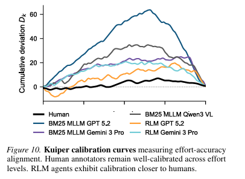
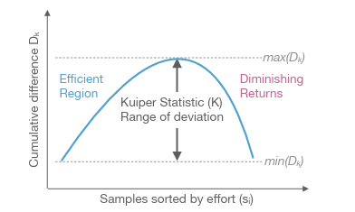
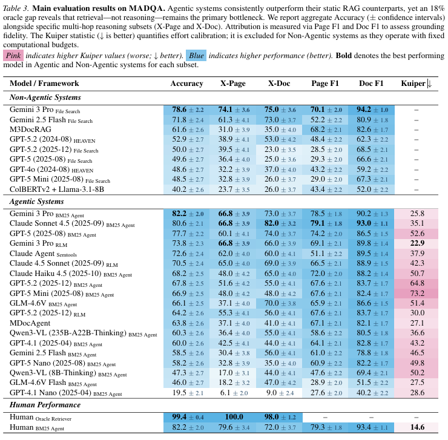

這篇 paper 給了一套 2250 題題庫，定義了衡量多模態 AI agent 「搜尋效率」的方法，並給出了有趣的觀察。

先講結論，Agent在搜尋上很擅長，但效率不如人類，可能是因為推理能力不足，agent甚至用暴力搜尋的方法 彌補了他推理能力不強的短版。

一般來說，代理人 (AI agent) 在訓練時，有個 Reward Function，我們用人為定義獎勵機制，讓 agent 往我們想要的方向發展。
但我們今天不是要講這個，我們是要比較 agent 訓練出來的成果，跟人類專家比起來，是贏是輸? 而比較標準是什麼? 比速度的話 agent 當然會贏，所以說要定義出類似「精準度」的東西。

這個東西叫做 Multimodal Agentic document QA benchmark。顧名思義，他要測試多模態(文字+圖片)的代理人，讀取多份文件後，問答表現的能力。

- MADQA資料集: 2250個人工撰寫的Q&A。
- 提供之參考文件: 來源自 800 份多樣化的文件，從金融報告到法律文件，從單頁到800多頁。視覺差異性大。文件之間在版面視覺密度差異巨大，金融和政府的文件表格密度高，技術文件圖形多等等。
- 難度: 
    * 多跳 (multi-hop) 問題。任務無法透過單一步驟的檢索解決。需進行規畫、導航，整合來自多個不連續甚至多個文件的資訊 (8.3%跨頁，9.0%跨文件)。最終聚合成答案。
    * 單純關鍵字匹配 (n-gram) 無法解決。
    * 視覺感知: 多達 58% 問題受益於理解結構化版面、表格或視覺元素。
- 邊界: 
    * 封閉世界: 答案完全從提供的資料庫中導出，要有依據。在無文件情況下，猜對機率僅11%。(其中3%來自運氣，8%可能來自訓練汙染)
    * 歸因: 答案必須準確歸因於最小的證據集。懲罰冗餘。

如何衡量，agent的表現? 除了答對問題?

本文引用了 Kuiper Statistic (庫柏統計量), K value。

> 〔先講一個錯誤版本〕
> 假設題目的難度標記從 1 分到 100分，那我們花的時間，預計也要跟它呈正比。例如在難度1分的題目上若花 1分鐘，在難度100分的題目就是花 100分鐘。(假設這個難度量表有設計好)。那Kuiper Statistic其實很好理解，就是「多花的最長時間」加上「少花的最長時間」。比方說 agent 表現最差(最浪費時間) 是在難度3分的題目上花了10分鐘(超出預期7分鐘)，然後太快放棄的是在難度70分的問題只花了 55分鐘(少花了15分鐘)，那這個agent 的K value就是 7 + 15 = 22。

直觀上我們想這樣定義，但是，量表怎麼設計? 誰設計的準? 沒有辦法。而且，客觀上我們只知道 agent 答對與否(0分或1分)。沒有對於答案品質的量化指標。

所以我們改一種方式。因為我們題目很多，所以可以用機率模型來思考，也就是研究「答對率」與「花費時間」的關係。我們期望他是一個常數。

>假設有2000道題，我們把所有題目根據「agent花費的時間」(或者說，搜尋使用的step數，總之就是一個正實數)，由小排到大。
>在這個排序下，我們希望，不管花多少時間，agent的答對率是「均勻的」。直覺來說，如果花比較少時間的題目 答對率較高，花較多時間的題目，答對率較低，那不就代表，其實那些花較多時間的題目是多餘的，應該要降低才對。那才是均勻分配時間的方法。

但具體來說，可能花費時間 = 20 的只有一個取樣點，這要怎麼算答對率? 這時就是利用 paper 中的計算 cumulative 的方法來解決。在這邊就先不仔細展開。

研究結果: 有趣的發現是，

* Agent > RAG
* Agent != Human。代理人與人類擅長的問題很不一樣。agent常依賴「暴力搜尋」彌補策略不足。
* Agent ~ Oracle * 80%。 代理人擅長檢索，但不擅長推理。
* Agent's K value >> Human's K value。代理人常花多餘的時間在搜索。
* 隨著模型能力提升，檢索失敗類型的Error逐漸減少，轉向 理解失敗。證明了檢索是已被解決的問題。
* 靈活的搜尋策略(用不同詞彙或方式重新搜尋) 與成功率成呈正相關。
* !? 跨文件比單文件容易? 原因不明。

---
## 結語

學者們設計了一套 open book 題庫，目的不是在難倒AI，最強模型答對率已經有七成，但重點是，這些agent到底怎麼找出答案的，我們在剖析他們的搜尋方法 (不能說解剖思考過程，那是另一回事了)。

## 實驗結果展示

